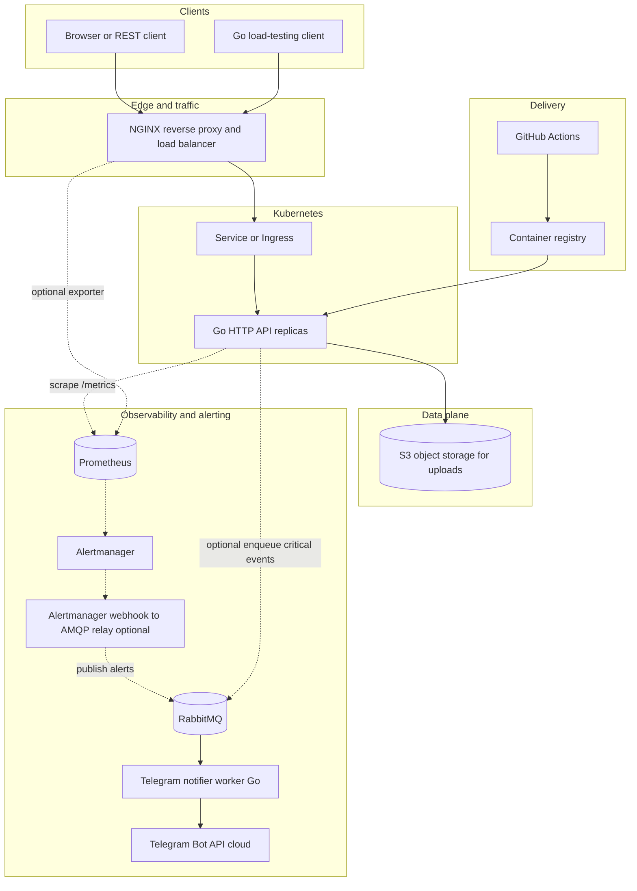
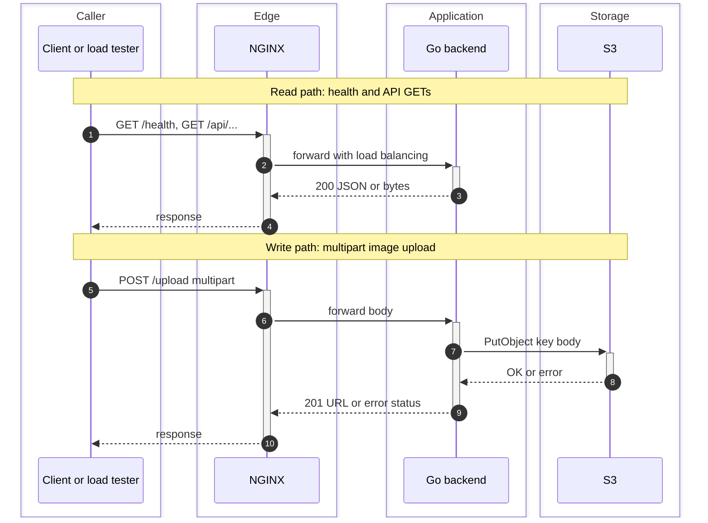
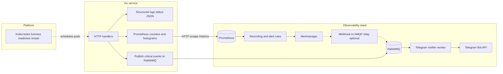
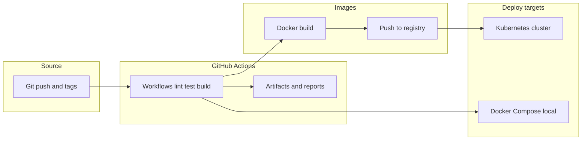
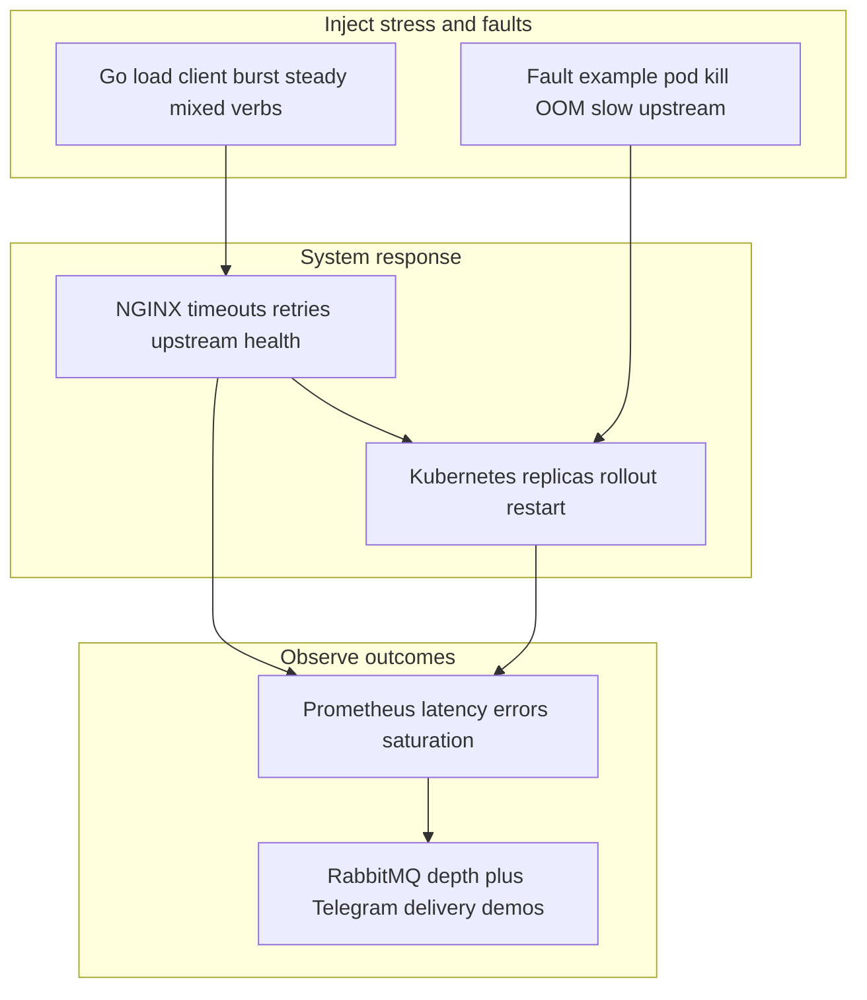

# Final project · microservices, resilience & observability

Demonstrate **recovery** and **monitoring** behavior under stress: a Go HTTP surface behind **NGINX**, **S3** for uploads, **Prometheus** for metrics and alerting, **Kubernetes** for automated restarts, **Docker Compose** for local stacks, **GitHub Actions** for delivery and reports, plus **critical notifications through RabbitMQ** to a **Telegram notifier worker** (buffered, decoupled delivery).

**Target topology · edge lab host:** All **server-side** pieces (API, NGINX, Prometheus, **RabbitMQ**, Telegram worker, storage, optional Alertmanager/Kubernetes) run on a small **edge lab host**—for example a **Raspberry Pi** with **Ubuntu Server**. The **Go load-testing client** runs on your **workstation** and calls the host over the LAN or internet so you can observe **real network effects**; use **SSH** on the host for logs and **`curl`** or API routes for quick status. Full layout and per-part deploy steps: **[docs/edge-lab-host.md](docs/edge-lab-host.md)**.

**Stack overview**

Go API · Go load client · NGINX · S3 · Prometheus · RabbitMQ · Telegram worker · Kubernetes · Compose · Actions

---

## Component responsibilities

Each building block below has a narrow job; together they mimic a **small microservice-style deployment**: observable traffic paths, durable uploads, automation, and recovery when things break.

### Go HTTP backend

- Serves **HTTP** routes the project defines (typically **GET** for health/read paths and **POST** for writes).
- Validates and handles **multipart image uploads**, turns them into object keys and bytes, and talks to storage through the **S3 API** (AWS S3 or a compatible server such as MinIO).
- Exposes a **`/metrics` (Prometheus)** HTTP endpoint instrumented from handlers (requests, durations, errors) so dashboards and alerts reflect real behaviour.
- Emits **structured logs** (for example JSON on stdout): request metadata, failures, and upload outcomes. These complement metrics: logs answer *what happened to this request*, metrics answer *how often and how slow*.
- For **critical human notifications**, publishes **compact JSON messages to RabbitMQ** (non-blocking or short-timeout publish) rather than calling Telegram synchronously—the **[Telegram](./docs/telegram.md)** worker consumes the queue and invokes the Bot API.

### RabbitMQ

- Holds **notification messages** between **producers** (Go API domain events and optionally an **Alertmanager webhook-to-AMQP** relay) and the **Telegram notifier worker**.
- Gives **durability** and **spike buffering** during Telegram downtime or slow HTTP; isolates outbound rate limits from the API’s request goroutines.
- On the **[edge lab host](./docs/edge-lab-host.md)** runs as another Compose service (**5672** AMQP internally; expose **management UI** only with care).

### Go load-testing client

- Runs on the **workstation** (not on the edge lab host) and drives **controlled load** against the API URL of the Pi/server (through **NGINX** on the host when that matches your demo).
- Mixes **GET**, **POST**, and upload-style calls to simulate realistic or worst-case blends.
- Records **latency percentiles**, error counts, and timeouts so you can compare runs (before/after faults, scaling, or config changes).

### S3-compatible object storage

- Stores uploaded **binary image objects** durably under unique keys (paths); the backend does not rely on local disk for long-term blobs.
- Degradation or misconfiguration surfaces as **failed writes** or slow PUTs—in Prometheus you see spikes on error or latency histograms tied to upload handlers.

### NGINX

- Terminates TLS **optionally**, then acts as **reverse proxy** and **load balancer** in front of one or more Go backend instances.
- Spreads connections across upstreams (**round-robin**, **least_conn**, or similar), and can enforce **timeouts**, **limits**, and **retries**, which shapes how callers experience partial failures versus full outages.

### Docker Compose

- Defines **containers and networks** for a **repeatable local or demo stack**: backend, NGINX, Prometheus (and optionally MinIO, Alertmanager stubs, etc.).
- Lets you iterate without a cluster—useful before **Kubernetes**, or for graded demos that must run anywhere with Docker.

### Prometheus

- **Scrapes** time-series from the Go **`/metrics`** endpoint (and optionally NGINX exporters) on an interval you configure.
- Drives **dashboards** (latency, RPS, error rates, saturation) and **alert rules** when thresholds breach. It is optimised for **numeric signals**, not unlimited raw log retention; pair it with logs for deep dives.

### Kubernetes

- Runs the Go service as **Pods** behind a **Service** (and often **Ingress**). **Deployments** keep a desired **replica count**.
- **Liveness** and **readiness** probes remove or avoid sending traffic to unhealthy instances; the control plane **restarts** or **reschedules** failing workloads so the system **recovers** without manual intervention after crashes or node issues.

### GitHub Actions

- Automates **CI**: tests, linters, **Docker image builds**, and pushes to a **container registry**.
- Automates **CD** (or promotion steps): apply manifests to a cluster, update Compose references, or roll tags—depending on how you wire the repo.
- Publishes **reports and artifacts** (test output, load-test summaries, security scans) so history and grading evidence live next to the code.

### Telegram (critical notifications)

- A **Telegram notifier worker** (Go consumer) drains **durable RabbitMQ queues** and calls **`sendMessage`** on the Telegram Bot HTTP API.
- Prometheus **rules → Alertmanager** should ideally hit a tiny **HTTP relay** that **publishes** into RabbitMQ—same buffering path as the API’s **producer** messages—not a synchronous hop straight to Telegram in hot paths.

---

## Documentation

Per-part references (API surfaces, configs, tooling): **[docs/README.md](docs/README.md)** · index table.

| Topic | Doc |
| --- | --- |
| Edge lab host (Pi / Ubuntu deploy, workstation client) | [docs/edge-lab-host.md](docs/edge-lab-host.md) |
| Go HTTP backend (endpoints, env, logging) | [docs/go-backend.md](docs/go-backend.md) |
| Go load-testing client | [docs/go-load-client.md](docs/go-load-client.md) |
| S3-compatible storage | [docs/s3-storage.md](docs/s3-storage.md) |
| NGINX | [docs/nginx.md](docs/nginx.md) |
| Docker Compose | [docs/docker-compose.md](docs/docker-compose.md) |
| Prometheus | [docs/prometheus.md](docs/prometheus.md) |
| Kubernetes | [docs/kubernetes.md](docs/kubernetes.md) |
| GitHub Actions | [docs/github-actions.md](docs/github-actions.md) |
| RabbitMQ (broker, producers, buffering) | [docs/rabbitmq.md](docs/rabbitmq.md) |
| Telegram notifier (worker, Bot API) | [docs/telegram.md](docs/telegram.md) |

---

## Architecture

Prometheus collects **metrics** (request counts, latencies, error rates). **Structured logs** go to stdout (optional aggregation). Critical notifications flow through **RabbitMQ**, then a **Telegram notifier worker**; Prometheus/Alertmanager can feed that path via an **Alertmanager webhook-to-AMQP** relay (**[docs](./docs/rabbitmq.md)**).

Diagrams use [Mermaid](https://github.com/mermaid-js/mermaid). They render on **GitHub** and in editors that enable Mermaid in Markdown preview (for example VS Code with a Mermaid extension). Plain ASCII labels avoid broken rendering where HTML or emoji in nodes is not supported.

---

### 1 · System topology

End-to-end view: clients, edge, workloads, storage, observability, and CI/CD.

---

### 2 · Request flows (GET, POST, upload)

---

### 3 · Observability: metrics vs logs · path to Telegram

> **Logging vs Prometheus:** use Prometheus for counters, histograms, and alerts; keep request IDs and payloads in structured logs unless you additionally ship metrics derived from logs. Notifications use **RabbitMQ** plus a **Telegram notifier**—see **[docs/rabbitmq.md](docs/rabbitmq.md)** and **[docs/telegram.md](docs/telegram.md)**.

---

### 4 · CI/CD and environments

---

### 5 · Stress, failure, recovery (what we demonstrate)

**Example scenarios**

| Scenario        | Expected signal                                                  |
| --------------- | ---------------------------------------------------------------- |
| Traffic spike   | Rising queue / latency histogram; errors if saturation           |
| Pod crash       | Brief drop in `up`; Kubernetes replaces pod; graphs recover       |
| S3 degraded     | 5xx spike on upload path; alert if error budget burned           |
| Rolling deploy  | NGINX sheds traffic from draining pods; replicas stay available  |
| Telegram worker stopped | RabbitMQ **queue depth rises**; restarting worker **drains backlog**; Prometheus still shows API `up` |

---

### Quick reference

| Piece | Role in one line |
| ----- | ---------------- |
| Edge lab host | Small server **(e.g. Raspberry Pi + Ubuntu)**; runs API, NGINX, Prometheus, RabbitMQ, notifier worker, storage; SSH for logs |
| Go API | HTTP app, uploads to S3, exposes `/metrics` and structured logs |
| Go client | Runs on **workstation**; synthetic load + latency/error stats against the **edge lab host** |
| NGINX | Proxy + load balancing + edge policy |
| Compose | Portable multi-service dev/demo stack |
| Kubernetes | Scheduling, probes, replicas, automatic recovery |
| Prometheus · Alertmanager | Metrics scrape and rules; optional webhook relay into RabbitMQ instead of Telegram directly |
| GitHub Actions | Build, publish images, deploy, attach reports |
| S3 | Durable blobs for uploads |
| RabbitMQ | Buffer between publishers (API, webhook relay) and Telegram worker |
| Telegram worker | Consumes queues; calls Telegram Bot API; holds bot token |

Narrative overview: [Component responsibilities](#component-responsibilities). Per-topic specs: [Documentation](#documentation).

---

*Microservices-ready layout: observable by default, recoverable under failure, repeatable via automation.*

