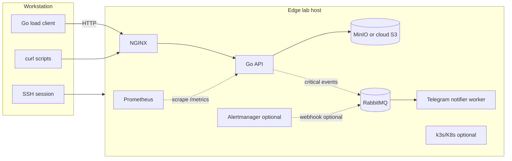

# Edge lab host (primary deployment target)

This project assumes a **split topology** for labs and coursework demos:

| Tier | Machine | Role |
| --- | --- | --- |
| **Edge lab host** | Small always-on server (**Raspberry Pi** 4/5 or similar, **Ubuntu Server** amd64/arm64) | Runs **all server-side** components: reverse proxy, Go API, Prometheus, **RabbitMQ**, **Telegram notifier worker**, object storage (MinIO) or cloud S3, optional webhook relay **→ AMQP**, optional Alertmanager/Kubernetes. |
| **Workstation** | Your laptop or desktop (any OS) | Runs only the **Go load-testing client**, web browser, and SSH client. |

Naming: **edge lab host** means “single-node home/lab server at the network edge,” not a managed cloud region. It intentionally has **tight CPU/RAM/IO** so saturation and recovery stories are visible without large clusters.

---

## Why this layout

- **Real network path:** Client → LAN or internet → host reproduces **timeouts, partial connectivity, and latency** better than `localhost`‑only tests.
- **Operator workflow:** SSH (`journalctl`, `docker compose logs`) for **logs**; **HTTP API** (`/health`, `/api/ping`, `/metrics`) for scripted checks from the workstation.
- **Controlled faults:** Stop containers, unplug Ethernet, throttle Wi‑Fi, or reboot the Pi while the workstation client keeps emitting load—classic **fault injection**.

---

## What runs where (summary)

- **GitHub Actions** does **not** run on the Pi by default—it runs on GitHub’s runners (build/test/publish). The host **consumes** images or binaries produced there (pull from registry, or `docker compose build` on device).
- **Telegram** is invoked only by the **notifier worker** over HTTPS to **`api.telegram.org`**; **RabbitMQ** sits between publishers and that worker (**[rabbitmq.md](./rabbitmq.md)**, **[telegram.md](./telegram.md)**).

---

## Deploying each part on the edge lab host

### Go HTTP backend

- Ship as a **container** in Compose (recommended) or as a **systemd** + binary if you avoid Docker on Pi.
- Bind **inside** Docker network to `:8080`; expose only via **NGINX** to the LAN (or port-forward with care).
- Set `S3_*` env to reach **MinIO on the same host** (`http://minio:9000`) or **AWS** over the internet.
- After deploy, from workstation: `curl http://<host-ip>:<nginx-port>/health` and `.../api/ping`.

### NGINX

- Runs on the **edge lab host** as a container or system package; **published port** (e.g. `9080:80`) is what the workstation client uses as `-base-url`.
- Ensure `client_max_body_size` fits your largest test image; Pi disk is not the object store when using S3/MinIO.

### Docker Compose (recommended orchestration on the Pi)

- Install **Docker Engine** + Compose plugin on Ubuntu (ARM or amd64).
- Clone repo on the host, copy `.env`, run `docker compose up -d --build` from the project root.
- **Persistence:** map volumes for Prometheus TSDB and MinIO data so restarts keep history and buckets.
- **Logs:** `docker compose logs -f api nginx prometheus` over SSH.

### Prometheus (and optional Alertmanager)

- **Prometheus** container on the same Compose network; scrape target `api:8080` by **service name**.
- Optionally publish Prometheus UI on a **host-LAN-only** port (e.g. `9090` bound to `127.0.0.1` and use **SSH tunnel** from workstation: `ssh -L 9090:127.0.0.1:9090 user@pi`). Avoid exposing `/metrics` and Prometheus to the public internet without auth.
- **Alertmanager** **`webhook_configs`** should **`POST`** to an **Alertmanager‑to‑AMQP relay** (small HTTP receiver on Docker network) which **enqueues** into **RabbitMQ**—matching the **Go API publisher** path [described](./rabbitmq.md).

### RabbitMQ · Telegram notifier

- Add **`rabbitmq:3-management-alpine`** (or equivalent arm64-capable tag) plus a **telegram-notifier** image built from this repo (**`cmd/telegram-notifier`** Go main or similarly named Dockerfile target).
- **5672**: AMQP stays **inside** Compose unless you knowingly expose it for debugging **with auth**.
- Optional **relay** HTTP service listens only on **`alert-amqp-gateway:8090`** (example) reachable from **`alertmanager`** container.

### S3-compatible storage

- **MinIO** as a Compose service on the **edge lab host** keeps the demo self-contained (no AWS bill); ensure enough **SD/USB disk** for test images.
- **AWS S3** from the Pi works if the host has outbound HTTPS; credentials live in `.env` or Docker secrets on the device—**never** commit them.

### Kubernetes (optional on the Pi)

- **k3s** or **kubeadm** on Ubuntu arm64 is valid for “restart on failure” demos; it is heavier than Compose on a Pi—**2–4 GB RAM** minimum for a comfortable control plane + a few Pods.
- If you use k3s, still place **NGINX Ingress** or **NodePort** so the **workstation client** hits a stable `http://<host-ip>:<nodeport>` URL.
- **Alternative:** stay on **Compose only** for the Pi and document Kubernetes on a larger machine or cloud for the same manifests.

### GitHub Actions

- Runs in **GitHub’s cloud**; use it to **build** multi-arch images (`linux/arm64` for Raspberry Pi) and push to GHCR.
- On the **edge lab host:** `docker compose pull` or restart with new tag; or copy manifest apply if using k3s.
- Optional self-hosted runner **on** the Pi is possible but usually unnecessary for this course scope.

### Go load-testing client

- **Not** deployed to the edge lab host. Build and run on the **workstation** with `-base-url http://<edge-lab-host>:9080` (through NGINX). See [go-load-client.md](./go-load-client.md).

### Telegram (via notifier worker)

- Runs as a **container on the Pi**; **broker + worker outbound HTTPS** toward **`api.telegram.org`**. Prefer storing **`TELEGRAM_BOT_TOKEN` only on the worker** secrets / `.env` slice, **not** in the core API runtime when the API merely publishes opaque JSON alerts.

---

## Operations from the workstation

| Goal | Approach |
| --- | --- |
| Shell and logs | `ssh user@<edge-lab-host>` then `docker compose logs -f`, `journalctl -u ...`, or `htop`. |
| Quick health | `curl http://<host>:<port>/health`, `/ready`, `/api/ping`. |
| Metrics text | `curl http://<host>:<internal-or-tunneled>/metrics` (restrict exposure). |
| Prometheus UI | SSH port-forward to `127.0.0.1:9090` on the host. |
| Load test | Run `loadtest` binary locally against the host URL. |

---

## Network and safety notes

- Prefer **private LAN** or **VPN**; if you port-forward from the public internet, add **firewall** rules and consider **TLS** termination at NGINX.
- Treat **Pi SD card** wear: log volume and Prometheus retention—keep **short retention** for labs (`--storage.tsdb.retention.time=7d` or similar).

---

## Related docs

- [Go backend](./go-backend.md) · [Load client](./go-load-client.md) · [Compose](./docker-compose.md) · [NGINX](./nginx.md) · [Prometheus](./prometheus.md) · [RabbitMQ](./rabbitmq.md) · [Telegram notifier](./telegram.md) · [Kubernetes](./kubernetes.md) · [GitHub Actions](./github-actions.md) · [S3](./s3-storage.md)
